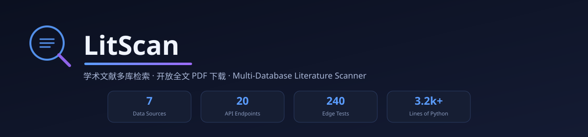
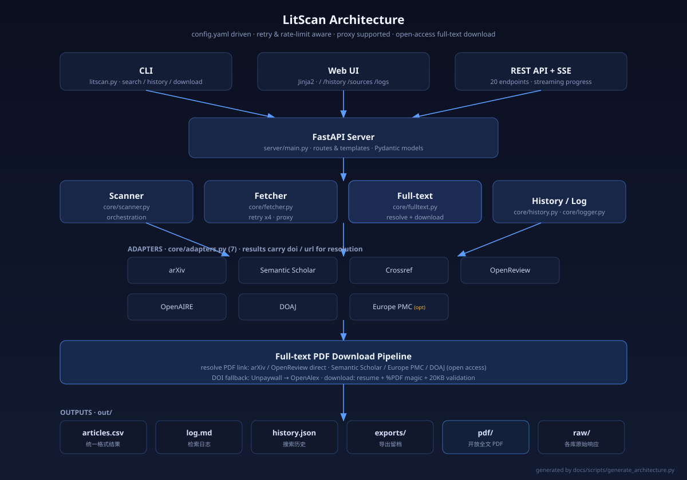

# LitScan 学术文献多库检索工具



给关键词，自动从多个学术数据库拉取文章信息，输出标准化结果。

**仓库地址**: <https://github.com/LPK3215/LitScan>

[](CHANGELOG.md)
[](LICENSE)
[](https://www.python.org/)

## 快速开始

```bash
pip install -r requirements.txt
python litscan.py --serve     # 启动服务，访问 http://127.0.0.1:8000
```

## 三种使用方式

### 1. Web 页面（推荐）

```bash
python litscan.py --serve     # 打开浏览器访问 http://127.0.0.1:8000
```

<!-- TODO: 截图待补充 -->
<!-- TODO: 截图待补充 (history / sources / logs 页面) -->

页面:
- `/` — 检索页面（输入关键词、选数据源、看结果，支持 SSE 流式进度）
- `/history` — 检索历史（查看/重跑/删除）
- `/sources` — 数据源列表
- `/logs` — 操作日志（查看运行日志与统计）

### 2. CLI 模式

```bash
python litscan.py                          # 用 config.yaml
python litscan.py -k "my research topic"   # 命令行指定关键词
python litscan.py -k "LLM agent" -y 2023 -l 20
python litscan.py --sort-by citations      # 按引用数排序 (relevance/citations/year)
python litscan.py --no-dedup               # 关闭跨库去重
python litscan.py --history                # 查看搜索历史
python litscan.py --history-search "LLM"   # 搜索历史记录
python litscan.py --retry 20260909_123456  # 从历史记录重新检索
python litscan.py --sources                # 列出检索源
python litscan.py --download               # 检索后下载开放全文 PDF（默认 20 篇）
python litscan.py --download-csv out/articles.csv  # 不检索，按 CSV 批量下载并断点续传
python litscan.py --serve -p 9000          # 指定端口启动服务
```

### 3. API 模式

```bash
python litscan.py --serve                   # http://127.0.0.1:8000
```

API 接口:

| 方法 | 路径 | 说明 |
|------|------|------|
| GET | /api/sources | 列出检索源 |
| POST | /api/search | 多库检索（支持 dedup / sort_by） |
| GET | /api/search/stream | SSE 流式检索（实时进度 + 限流/重试事件） |
| POST | /api/search/{source} | 单库检索 |
| GET | /api/articles | 最近一次结果 |
| POST | /api/export | 多选导出 (markdown/bibtex/endnote/csv/text) |
| GET | /api/download/supported | 各源全文 PDF 直下支持情况 |
| POST | /api/download | 批量下载开放全文 PDF（断点续传） |
| GET | /api/article/detail | 文章详情回源（站内快速预览） |
| GET | /api/stats | 运行统计 |
| GET | /api/history | 搜索历史 |
| GET | /api/history/stats | 历史统计 |
| GET | /api/history/{id} | 单条历史详情 |
| POST | /api/history/search | 搜索历史记录 |
| POST | /api/history/retry/{id} | 从历史重新检索 |
| DELETE | /api/history/{id} | 删除历史记录 |
| DELETE | /api/history | 清空历史 |
| GET | /api/logs | 操作日志 |
| GET | /api/logs/stats | 日志统计 |
| DELETE | /api/logs | 清空日志 |

调用示例:

```bash
curl -X POST http://127.0.0.1:8000/api/search \
  -H "Content-Type: application/json" \
  -d '{"keywords": "LLM agent evaluation", "limit_per_source": 10}'
```

## 支持检索源

| 库 | 格式 | 说明 |
|---|---|---|
| arXiv | XML | 预印本, 免费无上限 |
| Semantic Scholar | JSON | 429限流, 自动重试 |
| Crossref | JSON | DOI注册库 |
| OpenReview | JSON | 顶会评审 |
| OpenAIRE | JSON | 欧盟开放科学 |
| DOAJ | JSON | 开放获取期刊 |
| Europe PMC | JSON | 生物医学（默认关闭） |

## 结果处理

### 跨库去重与排序

同一篇论文常被多个库同时命中。LitScan 默认开启去重：

- **DOI 主键匹配**：归一化 DOI 后比对（去前缀、小写、去尾部标点）
- **标题 + 年份兜底**：无 DOI 时按归一化标题匹配，年份不同视为不同条目
- 重复条目**合并到信息更全的那条**（补缺失字段、取更大引用数），并在 `sources` 字段记录所有命中来源

排序支持 `relevance`（保留相关度原序）/ `citations`（引用数）/ `year`（年份）。

```bash
python litscan.py --no-dedup                 # CLI 关闭去重
python litscan.py --sort-by citations        # CLI 按引用数排序
```

```bash
# API
curl -X POST http://127.0.0.1:8000/api/search \
  -H "Content-Type: application/json" \
  -d '{"keywords": "LLM agent", "sources": ["arxiv","crossref"], "dedup": true, "sort_by": "citations"}'
```

### 多选导出

Web 端勾选结果后，底部操作栏可一键导出：

| 格式 | 用途 |
|---|---|
| Markdown | 文献收藏（标题/作者/链接/摘要） |
| BibTeX | LaTeX 引用，自动生成 citation key |
| EndNote (RIS) | EndNote / Zotero / Mendeley 导入 |
| CSV | Excel 打开 |
| 纯文本 | 复制到笔记 |

导出同时在 `out/exports/` 留档，路径在响应头 `X-Export-Path`。

```bash
curl -X POST http://127.0.0.1:8000/api/export \
  -H "Content-Type: application/json" \
  -d '{"format": "endnote", "articles": [{"title":"...","source":"arxiv","year":2024}], "keywords":"LLM"}'
```

### 站内快速预览

点击结果卡「🔍 快速预览」回源拉取完整信息（全量摘要、全部作者、PDF 直链、分类等），不跳转即可查看。30 分钟缓存。

```bash
curl "http://127.0.0.1:8000/api/article/detail?source=arxiv&url=https://arxiv.org/abs/1706.03762"
```

支持回源：arxiv / crossref / semanticscholar / openreview / europepmc / doaj；openaire 无单条接口，返回 501 并降级为原文链接。

### 全文 PDF 下载

检索结果中的**开放全文**可直接下载到 `out/pdf/`，不必再逐篇跳转官网。已下载且体积达标的文件自动跳过，中断后重跑即可续传。

| 数据源 | 能否直下 | 通道 |
|---|---|---|
| arXiv | ✅ 稳定 | 由链接/DOI 推导 `https://arxiv.org/pdf/{id}`，免费无上限，最稳定 |
| OpenReview | ✅ 稳定 | `https://openreview.net/pdf?id={note_id}`，开放评审均可下 |
| Semantic Scholar | ⚠️ 视论文而定 | 查 API 的 `openAccessPdf`，有开放获取版本才给直链 |
| Europe PMC | ⚠️ 视论文而定 | 仅开放获取 (OA) 子集可取到 PDF |
| DOAJ | ⚠️ 视期刊而定 | 取决于期刊是否在书目记录中给出 PDF 链接 |
| Crossref | ✅ 有条件 | 源本身只有元数据，转由 **Unpaywall / OpenAlex** 按 DOI 找合法 OA 版本 |
| OpenAIRE | ❌ 放弃 | 聚合索引，未接入单条记录接口，定位不到 PDF 直链 |

另有两条**通用正规通道**：任何带 DOI 的条目（不论来自哪个源）都会依次尝试
**Unpaywall → OpenAlex**，命中即下载作者自存档 / 预印本等「已公开标注为开放获取」的版本。

**为什么以前不能直接下载**：检索层只抓元数据（标题/作者/摘要/链接），从不请求全文；页面上只提供跳转官网的链接。

**哪些能下、哪些不能**——只走正规接口，不做任何绕过：

- ✅ 源自己提供的直链：arXiv / OpenReview
- ✅ 第三方 OA 索引已公开标注的开放获取版本：Unpaywall / OpenAlex（对任何有 DOI 的条目生效）
- ❌ 付费墙后**没有** OA 版本的（如 IEEE / Elsevier 订阅论文）：不下载、不绕过，回退到「原文」链接
- ❌ 连程序化检索都不开放的平台（如中国知网 CNKI）：无从下载，直接放弃
- 已登录用户的订阅权限属于账号行为，本工具**不使用、也不复用**任何登录会话

> 兜底通道需要联系邮箱进入免费「礼貌池」，默认用 `request.user_agent` 里的地址，可用环境变量 `LITSCAN_CONTACT_EMAIL` 覆盖。

下载有单次上限（`config.yaml` 的 `download.limit`，默认 20）与礼貌间隔（`download.delay`），避免触发对方限流；
单篇有效性用 `%PDF` 魔数 + 最小体积（默认 20KB）校验，避免把错误页/空壳当成 PDF 落盘。
Web 端多选下载按每 5 篇一批推进并实时显示 `n/N` 进度，完成后弹出结果明细（成功/跳过/失败/不支持、命中渠道与失败原因），全部文件落在 `out/pdf/`。

```bash
# CLI：检索后下载
python litscan.py -k "LLM agent" --download --download-limit 10

# CLI：从已有结果 CSV 下载（断点续传，可反复运行）
python litscan.py --download-csv out/articles.csv

# API
curl -X POST http://127.0.0.1:8000/api/download \
  -H "Content-Type: application/json" \
  -d '{"articles":[{"source":"arxiv","url":"https://arxiv.org/abs/1706.03762"}],"limit":5}'
```

## 架构



- **接入层**: CLI / Web UI / REST API + SSE 三种入口，共用同一套核心
- **核心层**: Scanner 调度 → Fetcher（重试 ×4、限流退避、代理）→ 7 个数据源适配器 → 去重排序
- **输出层**: 统一 CSV、检索日志、搜索历史、各库原始响应、开放全文 PDF
- 生成脚本: [`docs/scripts/generate_architecture.py`](docs/scripts/generate_architecture.py)（改动后可重新生成）

## 技术栈

| 层 | 技术 | 用途 |
|---|---|---|
| 后端 | FastAPI + Uvicorn | API 服务 + SSE 流式推送 |
| 数据校验 | Pydantic ≥2.0 | 请求/响应模型 |
| 模板 | Jinja2 ≥3.1 | Web 页面渲染 |
| HTTP | requests ≥2.31 | 各库数据抓取 |
| 配置 | PyYAML ≥6.0 | config.yaml 解析 |
| 测试 | FastAPI TestClient (httpx) | 边界测试 |

## 输出

```
out/
├── raw/              # 各库原始响应
├── exports/          # 多选导出留档 (md/bib/ris/csv/txt)
├── pdf/              # 开放全文 PDF（按编号命名，可断点续传）
├── articles.csv      # 统一格式文章列表
├── log.md            # 检索日志
└── history.json      # 搜索历史
```

## 代理配置

配置文件 config.yaml:
```yaml
request:
  proxy: "http://127.0.0.1:7897"   # 你的代理地址
```

或不配，自动读取系统环境变量 http_proxy / https_proxy。
加 `--no-proxy` 参数可强制不走代理。

### 常见代理问题

**SSL 握手失败 / Connection reset**
- Clash 代理开启了 SSL 拦截但证书不被信任
- 解决方法:
  1. Clash 里开启 "跳过 TLS 验证" (Skip TLS Verification)
  2. 或安装 Clash 的 root 证书到系统信任区
  3. 或把代理模式从 "Global" 切到 "Rule"，避免学术流量走代理

## 项目结构

```
LitScan/
├── litscan.py           # CLI 入口
├── config.yaml          # 配置文件
├── requirements.txt
├── core/
│   ├── fetcher.py       # HTTP + 重试 + 限流处理
│   ├── adapters.py      # 各库适配器
│   ├── scanner.py       # 调度器
│   ├── dedup.py         # 跨库去重 (DOI + 标题) 与排序
│   ├── exporter.py      # Markdown/BibTeX/EndNote/CSV/文本 导出
│   ├── fulltext.py      # 开放全文 PDF 下载（断点续传 + 有效性校验）
│   ├── article_detail.py # 文章详情回源（站内预览）
│   ├── history.py       # 搜索历史
│   ├── logger.py        # 操作日志
│   └── output.py        # CSV/日志输出
├── server/
│   └── main.py          # FastAPI 后端 + 模板路由
├── templates/           # Jinja2 模板
│   ├── base.html
│   ├── index.html
│   ├── history.html
│   ├── sources.html
│   └── logs.html
├── static/
│   └── style.css        # 样式
├── docs/
│   ├── assets/          # README 可视化资产 (SVG)
│   │   ├── banner.svg
│   │   └── architecture.svg
│   └── scripts/         # SVG 生成脚本 (可复用)
│       ├── generate_banner.py
│       └── generate_architecture.py
├── project_overview/    # 项目全景展示页 (dashboard)
├── project_overview.html# 展示页跳转入口
├── test_edge.py         # 核心模块边界测试
└── test_server_edge.py  # 服务端边界测试
```

## 测试

```bash
python test_edge.py          # 核心模块（不发网络请求）
python test_server_edge.py   # 服务端接口（仅验证逻辑）
```

## 后续可加

- 检索结果引用数排序 ✅（v1.1 已加）
- 跨库去重 (DOI主键匹配) ✅（v1.1 已加）
- 导出 BibTeX / EndNote ✅（v1.1 已加）
- 全文 PDF 批量抓取 ✅（已加，见「全文 PDF 下载」）
- 相似文献推荐

## 更新日志

见 [CHANGELOG.md](CHANGELOG.md)。

## FAQ

见 [FAQ.md](FAQ.md)。

## 贡献

见 [CONTRIBUTING.md](CONTRIBUTING.md)。

## License

[MIT](LICENSE) © 2026 LPK3215
